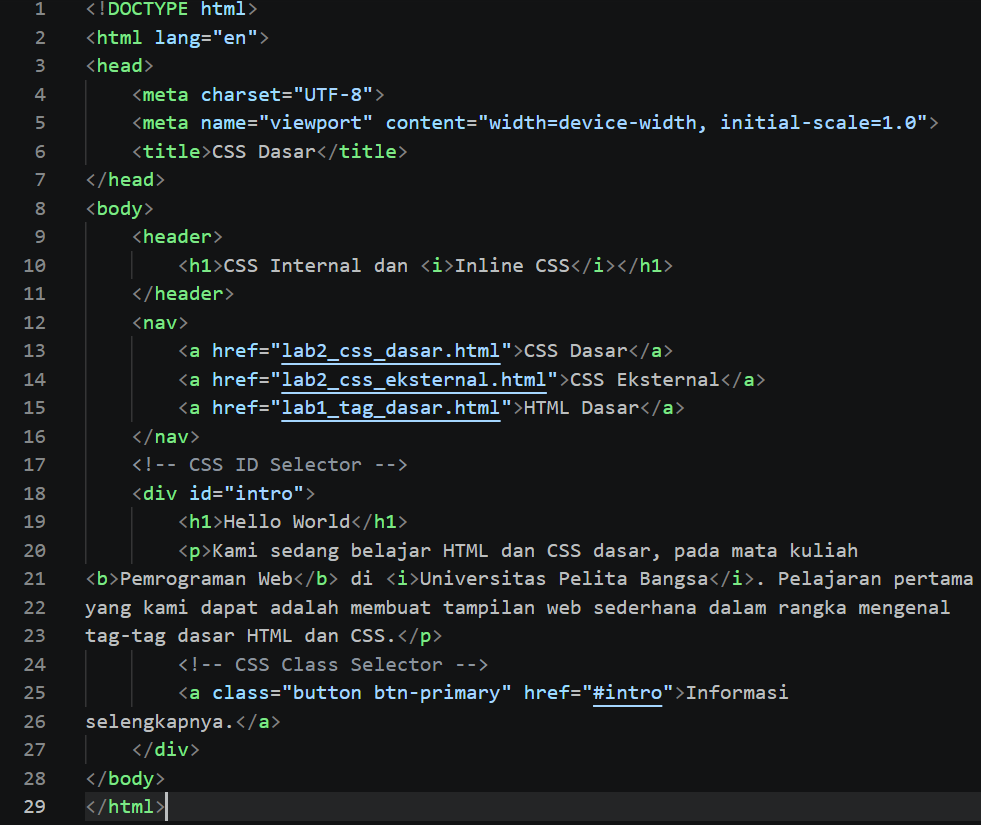
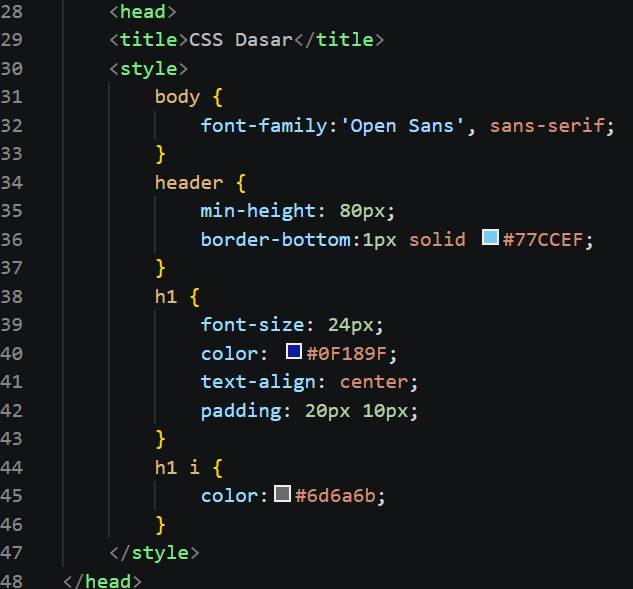
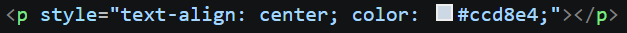
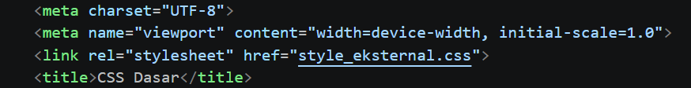
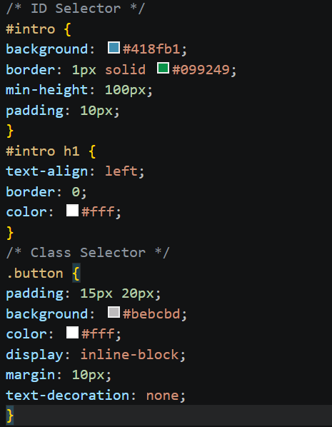
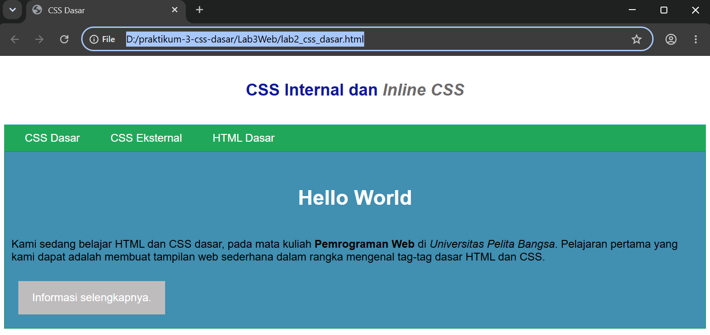
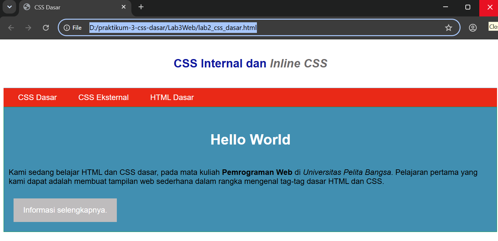
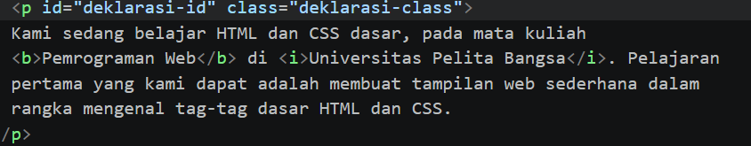

# Praktikum 3: CSS Dasar - Lab3Web

Praktikum mata kuliah **Pemrograman Web** memahami konsep dasar CSS, aturan penulisan, selector, serta penerapan CSS (Internal, Eksternal, dan Inline) pada dokumen HTML.

## Identitas Mahasiswa
Nama : Fuad Muhammad Adfal  
NIM : 312510262  
Kelas : I251A  
Mata Kuliah : Pemrograman Web

## 1. Langkah-Langkah Praktikum & Implementasi

### Langkah 1: Membuat Dokumen HTML Dasar 
Membuat struktur dasar dokumen HTML dengan menyertakan navigasi, elemen header, serta pembungkus dengan ID dan Class selector.

  
  

### Langkah 2: Mendeklarasikan CSS Internal
Menambahkan tag `<style>` pada bagian `<head>` dokumen untuk mengatur gaya dasar seperti font, padding, border, dan warna teks pada elemen `header` dan `h1`.

  
  

### Langkah 3: Menambahkan Inline CSS
Menambahkan deklarasi inline CSS langsung pada tag paragraf `
` untuk mengubah gaya pada baris tertentu secara spesifik.

  
  

### Langkah 4: Membuat CSS Eksternal 
Membuat file CSS terpisah untuk mengatur tata letak navigasi, warna latar belakang, serta efek hover pada menu. File eksternal dihubungkan menggunakan tag `<link>`.

  
  
  

### Langkah 5: Menambahkan CSS Selector (ID dan Class Selector)
Menggunakan ID Selector (`#intro`, `#intro h1`) dan Class Selector (`.button`) pada file `style_eksternal.css` untuk memberikan gaya spesifik pada elemen kontainer utama dan tombol tautan.

  
  

## 3. Pertanyaan dan Tugas

1. **Lakukan eksperimen dengan mengubah dan menambah properti dan nilai pada kode CSS.**
   *Experiment memindahkan letak text **Hello World** menjadi berada di tengah halaman.
        
        

2. **Apa perbedaan pendeklarasian CSS elemen `h1 {...}` dengan `#intro h1 {...}`? Berikan penjelasannya!**
   * *Jawaban:* 
     * `h1 {...}` adalah **Element Selector** yang akanmenerapkan aturan gaya ke **seluruh** tag `h1` di dalam dokumen HTML.
     * `#intro h1 {...}` adalah **Descendant / Combined Selector** yang hanya akan menerapkan aturan gaya pada tag `h1` yang berada **di dalam** elemen yang memiliki ID `intro`. Selector ini memiliki tingkat spesifisitas yang lebih tinggi dibandingkan element selector biasa.

3. **Apabila ada deklarasi CSS secara internal, lalu ditambahkan CSS eksternal dan inline CSS pada elemen yang sama. Deklarasi manakah yang akan ditampilkan pada browser? Berikan penjelasan dan contohnya!**
   * *Jawaban:* Yang akan ditampilkan dan diprioritaskan adalah **Inline CSS**, kemudian **Internal/Eksternal CSS**. Aturan umum dalam CSS menempatkan *Inline Style* pada prioritas tertinggi karena ditulis langsung pada elemen tersebut. Contoh : 
   
        
        
        

4. **Pada sebuah elemen HTML terdapat ID dan Class, apabila masing-masing selector tersebut terdapat deklarasi CSS, maka deklarasi manakah yang akan ditampilkan pada browser? Berikan penjelasan dan contohnya! (`
`)**
   * *Jawaban:* Deklarasi dari **ID Selector** akan lebih diprioritaskan dibandingkan **Class Selector**. Hal ini dikarenakan ID memiliki tingkat spesifisitas (specificity weight) yang jauh lebih tinggi daripada Class dalam hierarki CSS. Contoh :  
     
     
   